# 🍕 ASP-WOLT: Full-Stack Web Application & Recommendation System

## 📖 Overview
**ASP-WOLT** is a complete, multi-tier Full-Stack Web Application designed for restaurant data management, food ordering, and collaborative filtering product recommendations. The system is built on a robust 3-tier architecture:

1. **Frontend (React SPA):** A modern, responsive Single Page Application built with React and Bootstrap. Features a polished UI inspired by Wolt, including dynamic cart management, geolocation-based distance calculations, and Dark Mode.
2. **Web Server / API Gateway (Node.js & Express):** Serves the React frontend natively, handles JWT authentication, provides RESTful HTTP APIs, and manages the in-memory data store.
3. **Telemetry & Recommendation Engine (C++):** A high-performance background server connected via persistent **TCP Sockets** (Port 8080). It records system telemetry and executes collaborative filtering algorithms to provide real-time recommendations.

The architecture implements cross-server fault tolerance, allowing the Node.js server to handle C++ connection drops without crashing or disrupting the client-facing service.

*The project was developed as part of the Advanced Software Programming (ASP) curriculum at Bar-Ilan University (Assignment 4).*

---

## 💻 Prerequisites
Before you begin, ensure you have the following installed on your machine:
* **[Docker Desktop](https://www.docker.com/products/docker-desktop/)**
* **[Git](https://git-scm.com/)**

*(No Node.js or C++ compilers are required locally, as everything is containerized!)*

---

## 🛠️ Installation & Execution

We have optimized the execution flow using a **Multi-Stage Docker Build**. A single command compiles the React frontend, sets up the Node.js API, compiles the C++ engine, and links them all together.

**1. Clone the repository:**
```bash
git clone https://github.com/noamcalf/ASP-WOLT.git
cd ASP-WOLT
```
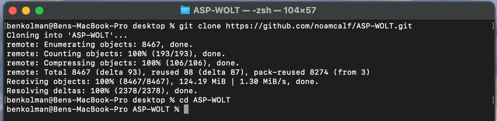

**2. Build and start the infrastructure using Docker Compose:**
```bash
docker-compose up --build
```
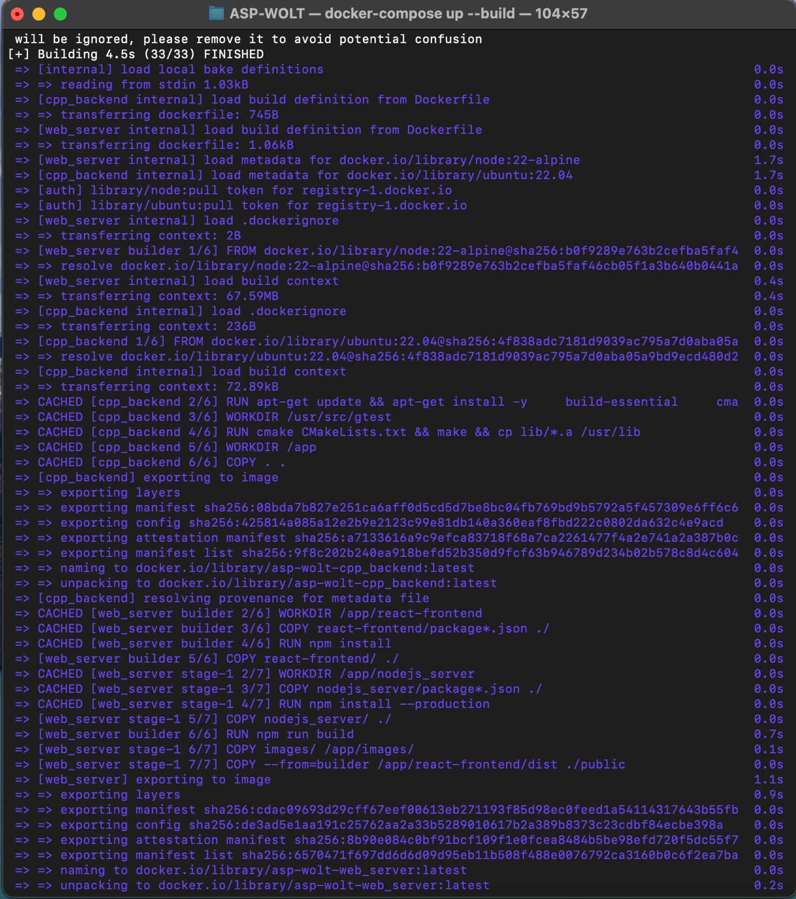
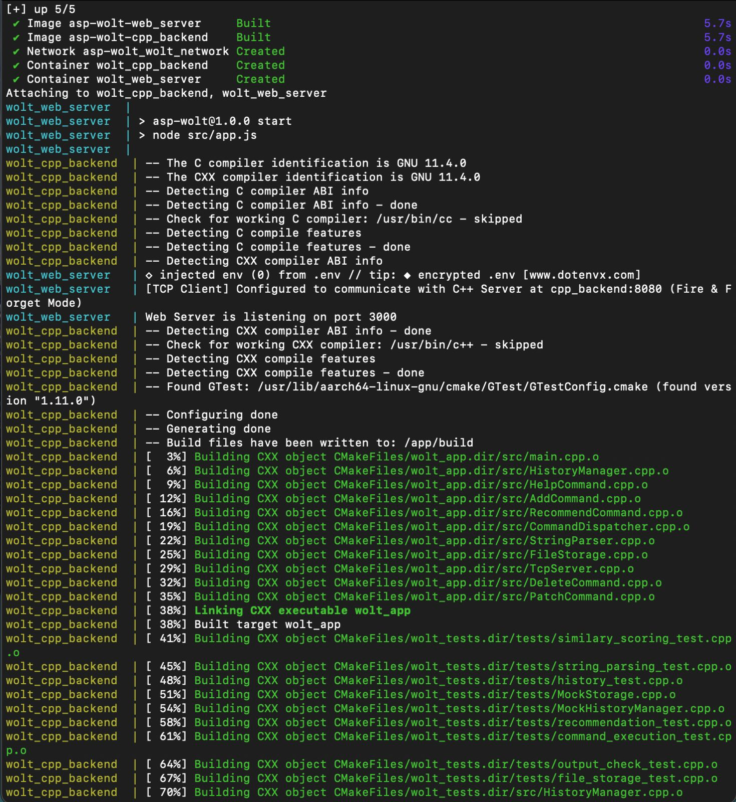
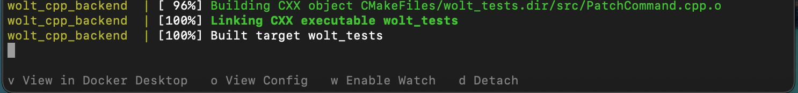

*(Docker will handle downloading the images, compiling the React App into static files, compiling the C++ code, and launching the services).*

**3. Access the Application:**
Once the terminal shows both servers are running, simply open your web browser and navigate to:
👉 **[http://localhost:3000](http://localhost:3000)**

---

## ✨ Features & Visual Walkthrough

*(Replace the placeholder images below with actual screenshots of your running application before submission).*

### 🔐 1. Authentication (Login & Registration)
The app features secure JWT-based authentication. Users must log in or register to access the marketplace. 
- Form validation ensures correct inputs (e.g., matching passwords, valid phone numbers).
- Separate roles exist for `customer` and `owner`.

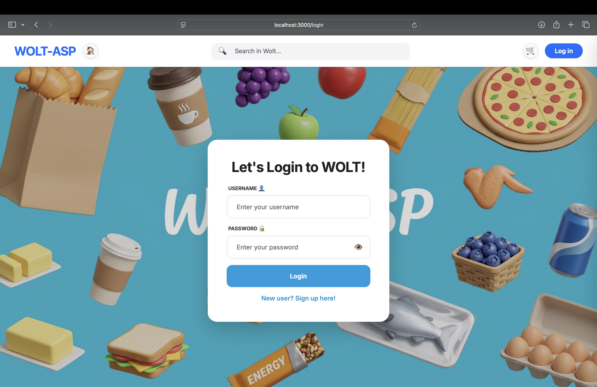
*(The secure Login Screen for returning users)*

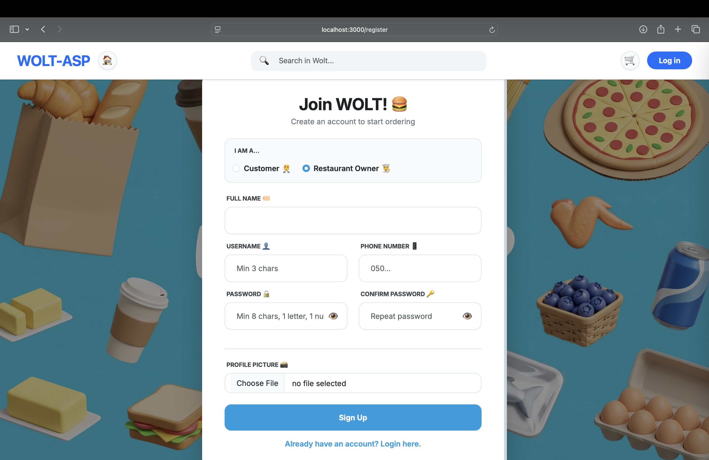
*(The Registration Screen with form validation for new customers and owners)*

### 🍔 2. Discovery Dashboard
The main screen organizes restaurants into smart, dynamic carousels:
- **Promoted Restaurants:** Automatically highlights the top-rated restaurants.
- **Nearby Restaurants:** Uses the user's geolocation and the restaurant's coordinates to calculate distance (`km`) and dynamically sorts the closest options first.
- **Categorized Carousels:** Groups restaurants dynamically by Cuisine (Fast Food, Italian, Desserts, etc.).

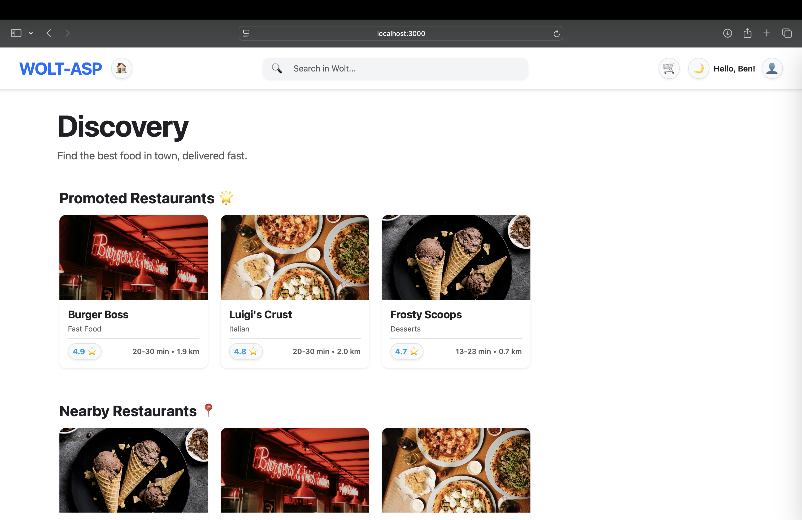
*(The main Dashboard screen showing categorized carousels, including Nearby and Promoted restaurants)*

### 🛒 3. Restaurant Menu & Cart Management
Navigating to a restaurant displays its full menu. 
- Users can click on products to view details and add them to their cart.
- A floating Cart Drawer manages the active order, calculates the total price dynamically, and allows quantity adjustments.
- Placing an order triggers a background telemetry event to the C++ server to improve future recommendations.

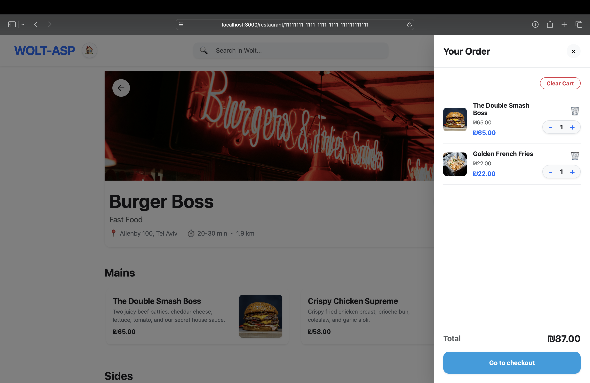
*(A Restaurant Menu with the interactive Cart Drawer open on the right)*

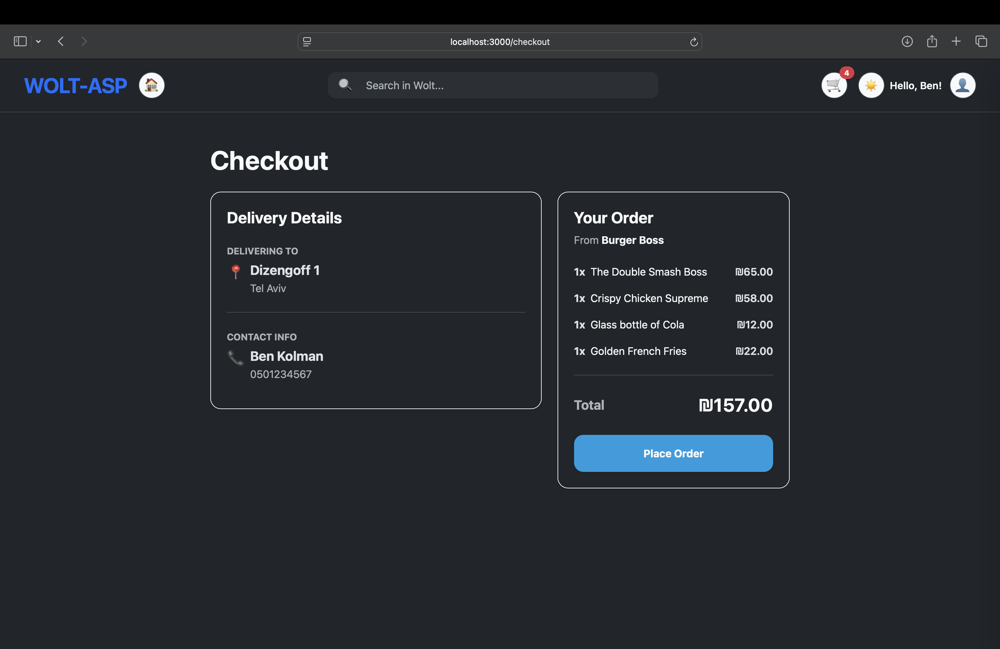
*(The Checkout Summary screen finalizing the active order)*

### 🌙 4. Dark Mode & Responsive Design
The entire application supports a seamless **Dark Mode**. A toggle in the navigation bar instantly swaps the global theme, recalculating text and background colors for optimal viewing in low-light environments. The layout is fully responsive using Bootstrap grids.

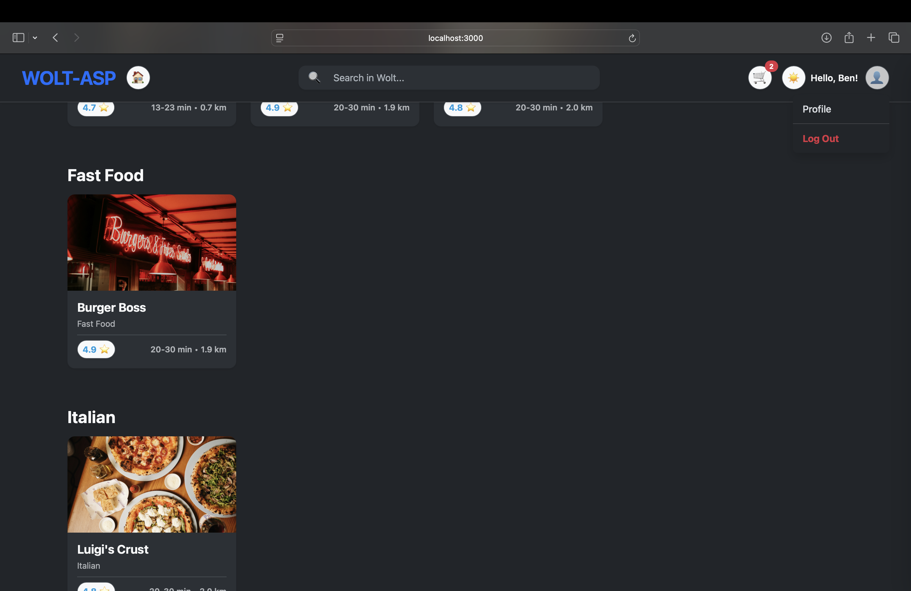
*(The application seamlessly rendering in Dark Mode)*

### 👨‍🍳 5. Owner Portal (Role-Based Access)
Users with the `owner` role have access to a dedicated Owner Dashboard. From here, they can:
- Manage their restaurant's details.
- Add, edit, or delete products from their menu.
- View and manage incoming customer orders.

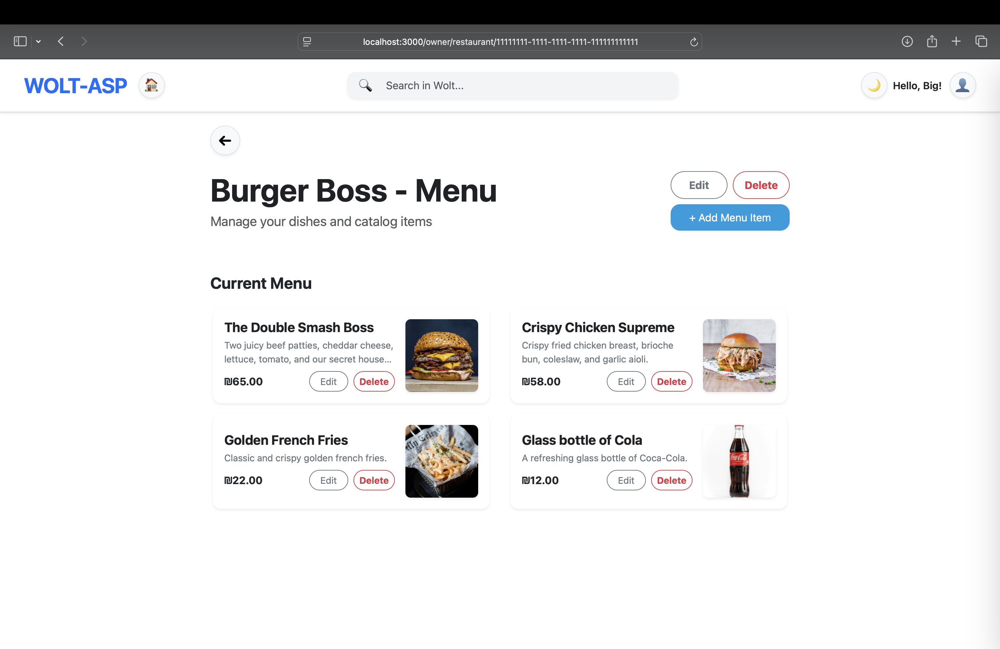
*(The Owner Portal allowing restaurant owners to manage their dynamic menu)*

### 🤖 6. Collaborative Filtering Recommendations
Powered by the C++ engine, the system analyzes user purchase histories to offer real-time product recommendations. When a user clicks on a product, the system suggests complementary items that similar users have bought.

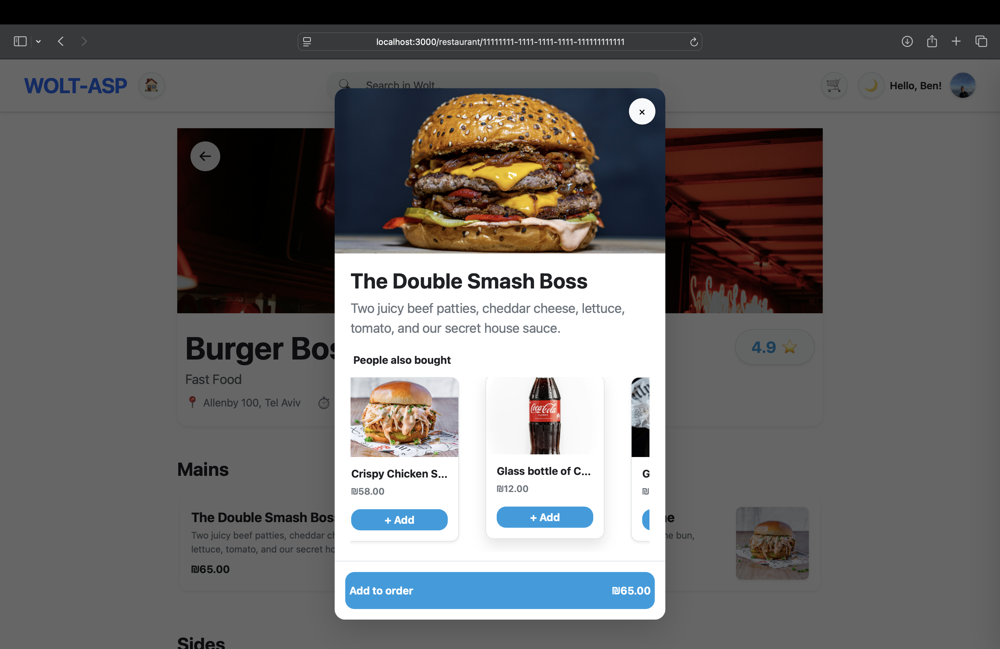
*(The Product Details Modal displaying 'People also bought' recommendations powered by the C++ backend)*

### 👤 7. Client Profile & History
Customers can access their personal profile to view and edit their orders, updating dynamically via the Node.js API.

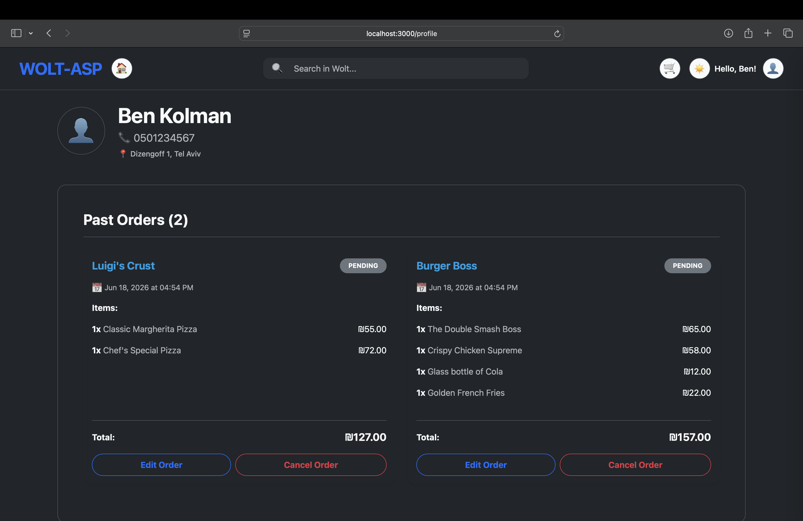
*(The Customer Profile screen showing order history and account details)*

---

## 📌 Version Control & Branch Management

To comply with the assignment requirements and ensure proper, isolated grading environments, we have strictly managed our codebase using dedicated Git branches:

* **Assignment 2:** Locked in the `ex2-submition` branch.
* **Assignment 3:** Locked in the `ex3-submition` branch.
* **Assignment 4:** All Full-Stack and React developments are organized in the `ex4-submition` branch.

This explicit separation ensures that the ongoing work does not mix with or overwrite the finalized submissions of previous assignments.