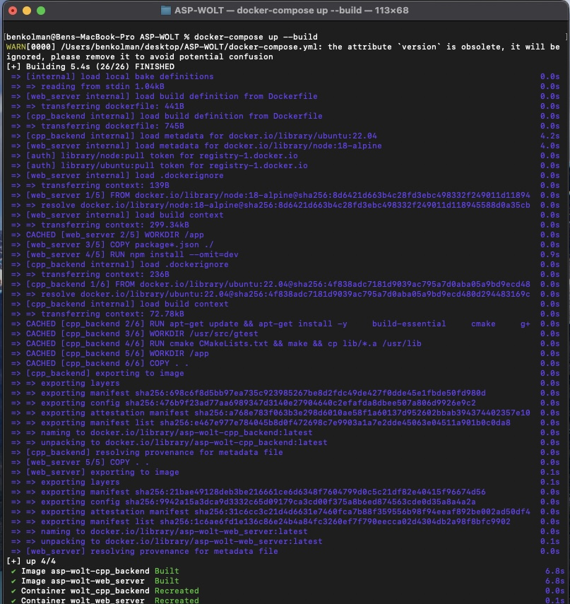
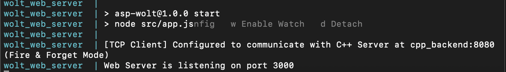
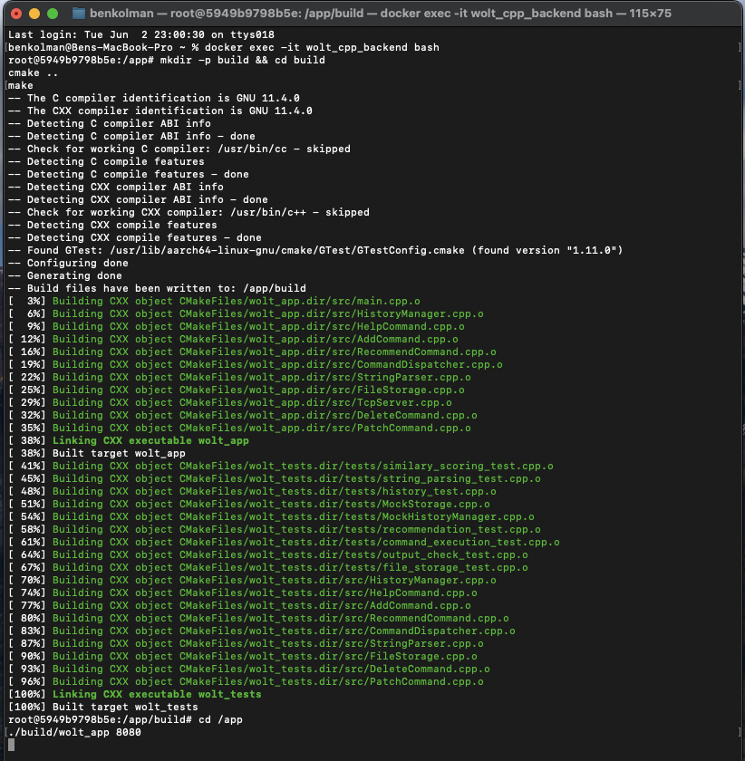
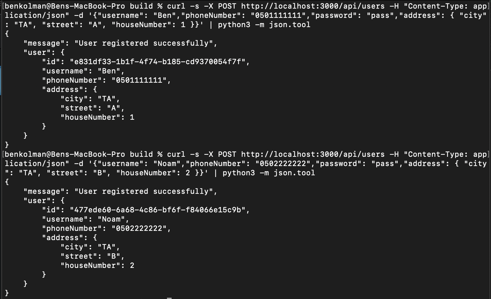
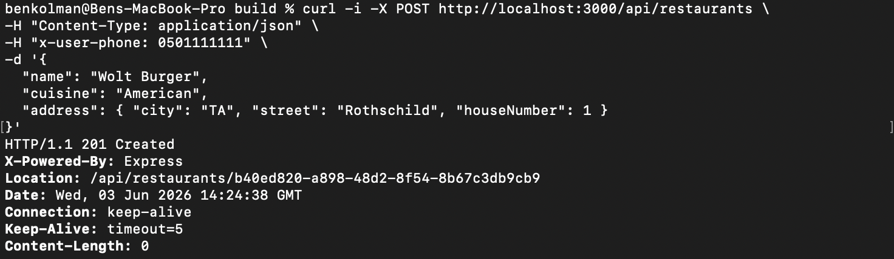
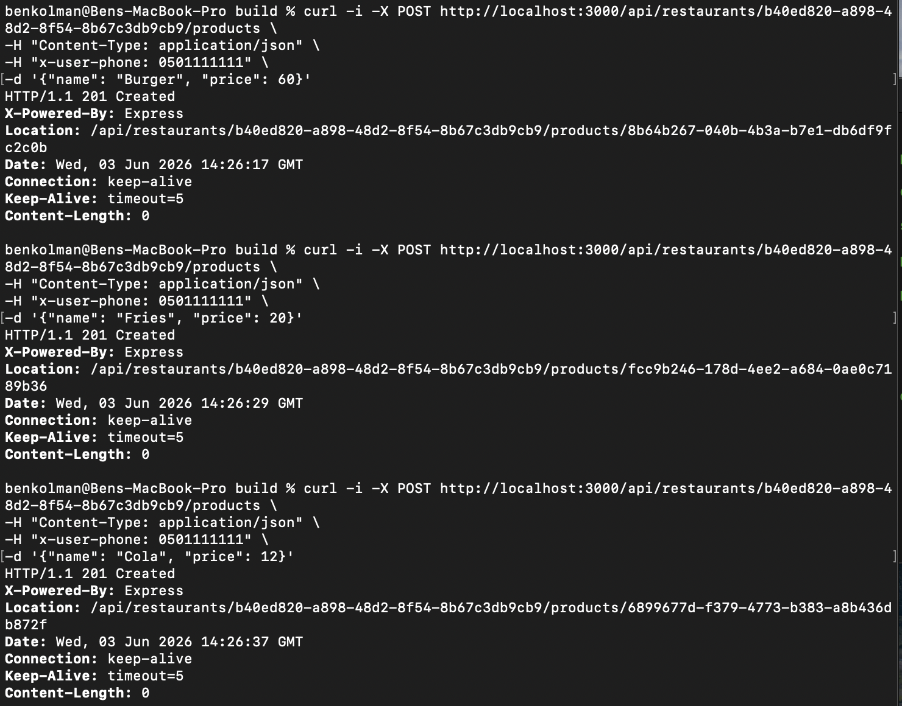
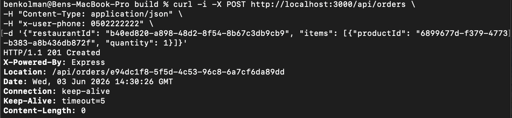
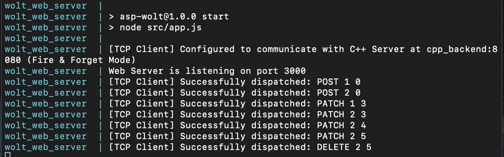
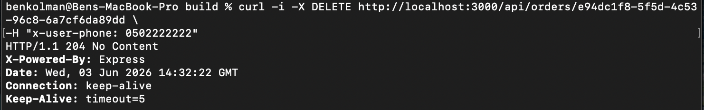
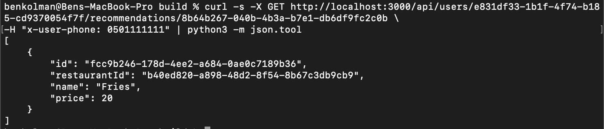

# 🍕 ASP-WOLT: Full-Stack Web & Recommendation System

## 📖 Overview
**ASP-WOLT** is a multi-tier Client-Server application designed for restaurant data management and collaborative filtering product recommendations. The system is divided into two decoupled components to optimize fault tolerance and separate computing concerns:

1. **Web Server (Node.js & Express):** Functions as the primary API Gateway. It exposes a RESTful HTTP interface utilizing JSON formatting for the CRUD operations of users, restaurants, products, and orders.
2. **Telemetry & Recommendation Engine (C++):** A high-performance background server connected via persistent **TCP Sockets** (Port 8080). It records system telemetry and executes the collaborative filtering algorithms.

The architecture implements cross-server fault tolerance, allowing the Node.js server to handle C++ connection drops without crashing or disrupting the client-facing HTTP service.

*The project was developed as part of the academic curriculum at Bar-Ilan University.*

---

## 💻 Prerequisites
Before you begin, ensure you have the following installed on your machine:
* **[Docker Desktop](https://www.docker.com/products/docker-desktop/)**
* **[Git](https://git-scm.com/)**
* **cURL** (Command line tool for making HTTP requests)

> **Note on cURL:** To verify cURL availability, execute `curl --version` in a terminal. If it is not detected, install it using your platform's package manager (e.g., `brew install curl` on macOS, `sudo apt install curl` on Linux).

---

## 🛠️ Installation & Build

The application requires orchestrating both backend services simultaneously. You will need to open **three separate terminal windows** to run the infrastructure, compile the backend, and execute client commands.

### Terminal 1: API Gateway & Infrastructure (Node.js)
This terminal handles the Docker composition and runs the Web Server, which automatically bridges the connection to the C++ server.

**1. Clone the repository:**
```bash
git clone [https://github.com/noamcalf/ASP-WOLT.git](https://github.com/noamcalf/ASP-WOLT.git)
cd ASP-WOLT
```

**2. Build and start the infrastructure using Docker Compose:**
```bash
docker-compose up --build
```


You can monitor the live logs to verify that the Node.js server has successfully established a "Fire & Forget" TCP connection to the C++ Engine:


### Terminal 2: Telemetry Engine Compilation (C++)
Open a new terminal window, connect to the running C++ container, and compile the backend logic.

**1. Compile and run the C++ Server:**
```bash
docker exec -it wolt_cpp_backend bash
mkdir -p build && cd build
cmake ..
make
```


**2. Start the Engine:**
```bash
cd /app
./build/wolt_app 8080
```
*(The C++ server is now active and listening on port 8080. Keep this terminal open).*

### Terminal 3: Client Interactions
Open a completely new terminal on your host machine. This terminal will be used to run all the `curl` commands interacting with the API Gateway on port `3000`.

---

## 🚀 Usage & API Endpoints

Execute these commands in **Terminal 3**. 
*(Note: Routes modifying user-specific data or state require the `x-user-phone` header for identity verification via middleware).*

### 1. Restaurants Management (`/api/restaurants`)

* **Get All Restaurants (GET)**
  ```bash
  curl -i -X GET http://localhost:3000/api/restaurants
  ```
* **Create a Restaurant (POST)**
  ```bash
  curl -i -X POST http://localhost:3000/api/restaurants \
    -H "Content-Type: application/json" \
    -H "x-user-phone: 0501111111" \
    -d '{"name": "Pizza Palace", "cuisine": "Italian", "address": {"city": "Tel Aviv", "street": "Rothschild", "houseNumber": 10}}'
  ```
* **Get Specific Restaurant Details (GET)**
  ```bash
  curl -i -X GET http://localhost:3000/api/restaurants/res123
  ```
* **Update Restaurant Details (PATCH)**
  ```bash
  curl -i -X PATCH http://localhost:3000/api/restaurants/res123 \
    -H "Content-Type: application/json" \
    -H "x-user-phone: 0501111111" \
    -d '{"name": "Updated Pizza Palace"}'
  ```
* **Delete a Restaurant (DELETE)**
  ```bash
  curl -i -X DELETE http://localhost:3000/api/restaurants/res123 \
    -H "x-user-phone: 0501111111"
  ```

### 2. Menu & Products Management (`/api/restaurants/:id/products`)

* **Get Restaurant Menu (GET)**
  ```bash
  curl -i -X GET http://localhost:3000/api/restaurants/res123/products
  ```
* **Add Product to Menu (POST)**
  ```bash
  curl -i -X POST http://localhost:3000/api/restaurants/res123/products \
    -H "Content-Type: application/json" \
    -H "x-user-phone: 0501111111" \
    -d '{"name": "Margherita Pizza", "price": 45, "description": "Classic cheese pizza"}'
  ```
* **Get Product Details (GET) - *Triggers Telemetry View***
  ```bash
  curl -i -X GET http://localhost:3000/api/restaurants/res123/products/pId99 \
    -H "x-user-phone: 0501111111"
  ```
* **Update Product Details (PATCH)**
  ```bash
  curl -i -X PATCH http://localhost:3000/api/restaurants/res123/products/pId99 \
    -H "Content-Type: application/json" \
    -H "x-user-phone: 0501111111" \
    -d '{"price": 49}'
  ```
* **Delete Product from Menu (DELETE)**
  ```bash
  curl -i -X DELETE http://localhost:3000/api/restaurants/res123/products/pId99 \
    -H "x-user-phone: 0501111111"
  ```

### 3. Orders Management (`/api/orders`)

* **Create a New Order (POST) - *Triggers Telemetry Patch***
  ```bash
  curl -i -X POST http://localhost:3000/api/orders \
    -H "Content-Type: application/json" \
    -H "x-user-phone: 0501111111" \
    -d '{"restaurantId": "res123", "items": [{"productId": "pId99", "quantity": 2}]}'
  ```
* **Get Active User Orders History (GET)**
  ```bash
  curl -i -X GET http://localhost:3000/api/orders \
    -H "x-user-phone: 0501111111"
  ```
* **Get Specific Order Details (GET)**
  ```bash
  curl -i -X GET http://localhost:3000/api/orders/ord555 \
    -H "x-user-phone: 0501111111"
  ```
* **Update Order Details (PATCH)**
  ```bash
  curl -i -X PATCH http://localhost:3000/api/orders/ord555 \
    -H "Content-Type: application/json" \
    -H "x-user-phone: 0501111111" \
    -d '{"status": "delivered"}'
  ```
* **Cancel/Delete an Order (DELETE) - *Triggers Telemetry Delete***
  ```bash
  curl -i -X DELETE http://localhost:3000/api/orders/ord555 \
    -H "x-user-phone: 0501111111"
  ```

### 4. Recommendation Engine (`/api/users/:userId/recommendations/:productId`)

* **Get Recommendations (GET) - *Fetches from C++ Engine***
  Returns a JSON array of recommended product IDs generated by the background collaborative filtering engine.
  ```bash
  curl -s -X GET http://localhost:3000/api/users/user123/recommendations/pId99 \
    -H "x-user-phone: 0501111111" | python3 -m json.tool
  ```

### 5. Global System Search (`/api/search`)

* **Query Search (GET)**
  Searches across restaurants or products matching the search phrase within their title, name, or description.
  ```bash
  curl -i -X GET http://localhost:3000/api/search/pizza
  ```

---

## 📸 Full Execution Flow Example

The following sequence demonstrates a complete, real-world user interaction lifecycle executed against the API Gateway, showing structured data manipulation and the collaborative filtering engine in action.

### Step 1: Registering New Users
We start by registering two users to the system. This action creates the users in the Node.js database and dispatches a background TCP command to allocate memory for their history profiles in the C++ backend:



### Step 2: Creating a Restaurant
Next, we create a new restaurant named "Wolt Burger" via the API. The server responds with a `201 Created` status and provides the unique ID of the restaurant.



### Step 3: Populating the Menu
Using the newly created restaurant ID, we populate its menu with three distinct products: a Burger, Fries, and Cola.



### Step 4: Product Views, Placing an Order & Telemetry
Users view products, and an order is placed for a Cola. You can see the Node.js server seamlessly dispatching `PATCH` commands to the C++ engine to actively log this viewing and purchase history.


*Server-side TCP dispatches confirming the history synchronization (visible in Terminal 1):*


### Step 5: Deleting an Order
A user decides to cancel the Cola order. The Node.js server handles the HTTP `DELETE` request and immediately dispatches a corresponding TCP `DELETE` command to the C++ engine to revert the user's history state cleanly.



### Step 6: Collaborative Filtering Recommendation
Finally, a user asks for a product recommendation based on the "Burger" they viewed. The C++ engine calculates similarities in the purchase history with other users, and accurately returns the recommended complementary product: **Fries**.



---

## 📌 Version Control & Branch Management

To comply with the assignment requirements and ensure proper, isolated grading environments, we have strictly managed our codebase using dedicated Git branches:

* **Assignment 2 (ex2-submition):** It is our responsibility to ensure the code submitted for Exercise 2 is securely locked in the `ex2-submition` branch. This guarantees that the grader can check the exact state of the server code for Exercise 2 without any interference.
* **Assignment 3 (ex3-submition):** All new developments, Node.js integration, and work for Exercise 3 are isolated in this branch. 

This explicit separation ensures that the ongoing work for Exercise 3 does not mix with or overwrite the finalized submission of Exercise 2.

⁠*Branch Protection Policy:* Both branches are governed by strict *Lock* rules on GitHub. This safety mechanism enforces read-only immutability, preventing accidental overwrites, retroactive deletions, or forced pushes after final submission to guarantee codebase integrity.