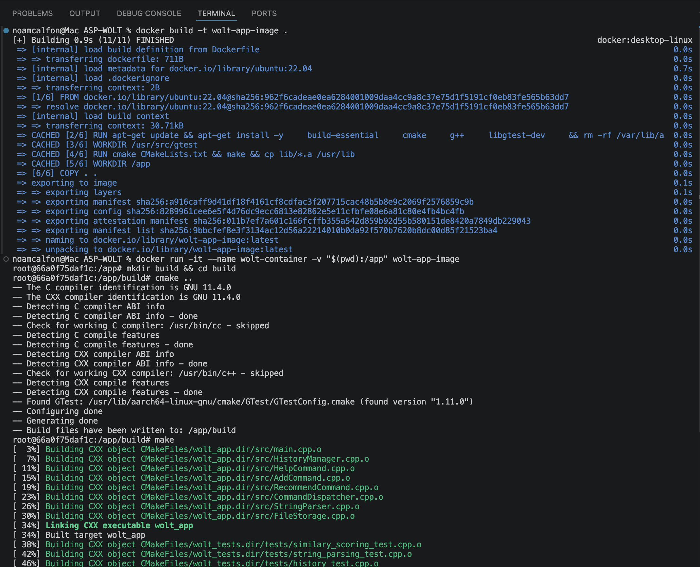
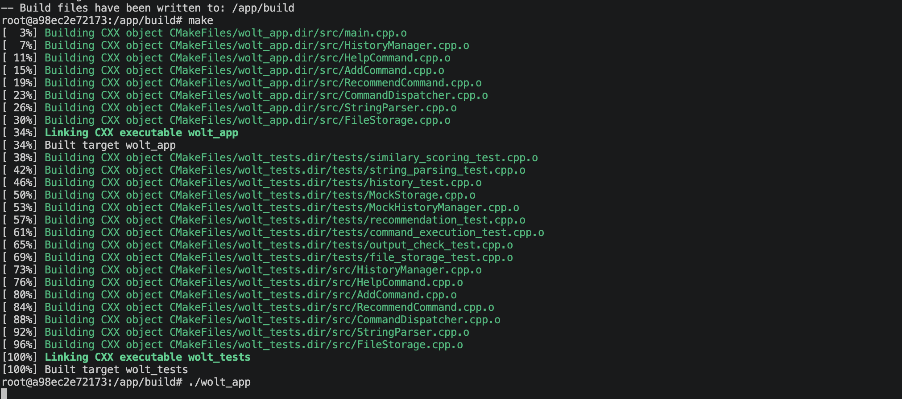
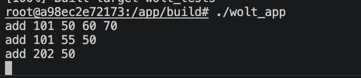
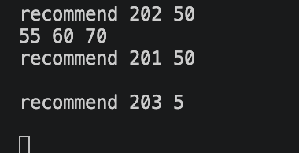
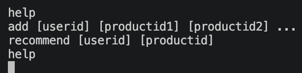

# 🍔 ASP-WOLT: Product Recommendation System

## 📖 Overview
**ASP-WOLT** is a C++ based Command Line Interface (CLI) application designed to provide personalized product recommendations for users based on their purchase history. The system calculates user similarity using advanced collaborative filtering algorithms and persists data to ensure history is maintained between sessions.

*The project was developed as part of the academic curriculum at Bar-Ilan University.*

---

## 🛠 Prerequisites
Before you begin, ensure you have the following installed on your machine:
*   [Docker Desktop](https://www.docker.com/products/docker-desktop/)
*   [Git](https://git-scm.com/)

> **Note:** The application environment is standardized via Docker. The Dockerfile is configured to use Bash as the primary shell. All execution paths and scripts are designed for a Bash-compliant environment to ensure consistency across different host systems.

---

## 🚀 Installation & Build

Follow these steps to get your development environment running:

**1. Clone the repository:**
```bash
git clone https://github.com/noamcalf/ASP-WOLT.git
```

**2. Enter the repository:**
```bash
cd ASP-WOLT
```

**3. Build the Docker image:**
```bash
docker build -t wolt-app-image .
```

**4. Run the container:**
```bash
docker run -it --name wolt-container -v "$(pwd):/app" wolt-app-image
```

**5. Create and enter the "build" directory:**
```bash
mkdir build && cd build
```

**6. Configure the project with CMake:**
```bash
cmake ..
```

**7. Compile the application:**
```bash
make
```

**8. Return to the main application directory:**
```bash
cd /app
```

**9. Run the app:**
```bash
./build/wolt_app
```

### Build Process Previews:



---

## 💻 Usage & Execution Examples

Once the application is running, you can interact with it using the following commands. 
*(Note: Invalid inputs or ignored commands print absolutely nothing).*

### 1. ADD
Use the `add` command to register at least one product for a specific user.
*   **Syntax:** `add <userId> <productId1> <productId2> ...`

**Example Usage:**
```text
add 101 50 60 70
add 101 55 50
add 202 50
```
> **Expected output:** No output. The operation is performed silently.



### 2. RECOMMEND
Use the `recommend` command to find products a user might like based on the purchase history of other users with similar tastes.
*   **Syntax:** `recommend <userId> <productId>`

**Example Usage:**
```text
recommend 202 50
recommend 201 50
recommend 203 5
```
> **Expected output:** All the recommended product IDs based on the algorithm, separated by a single whitespace. If the command fails or there are no recommendations, an empty line is printed.



### 3. HELP
Use the `help` command to print all the available commands and their syntax.
*   **Syntax:** `help`

**Example Usage:**
```text
help
```
> **Expected output:** A list of all commands, each printed on a new line with its required syntax.

