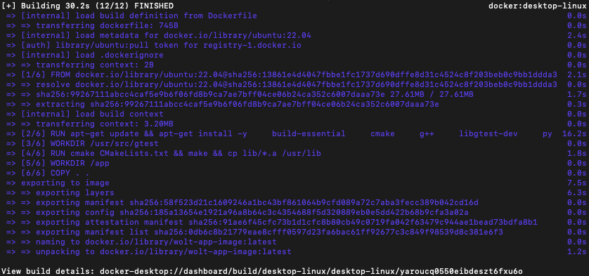
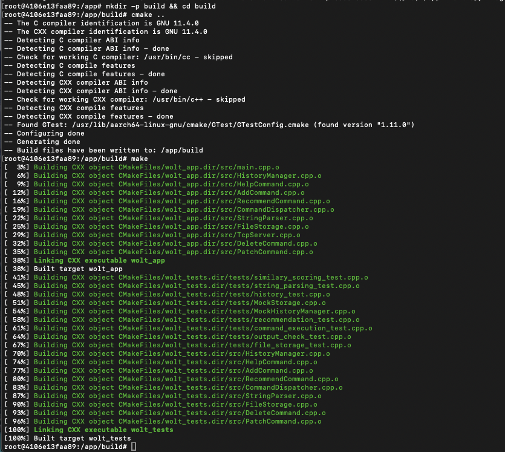
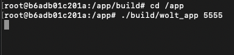
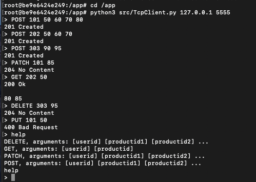

# 🍕 ASP-WOLT: Product Recommendation System (Client-Server Architecture)

## 📖 Overview
**ASP-WOLT** is a C++ based Client-Server application designed to provide personalized product recommendations for users based on their purchase history. The system calculates user similarity using advanced collaborative filtering algorithms. In this version, the architecture has been upgraded to a robust Client-Server model using TCP Sockets, supporting a standard HTTP-like communication protocol.

*The project was developed as part of the academic curriculum at Bar-Ilan University.*

---

## 💻 Prerequisites
Before you begin, ensure you have the following installed on your machine:
* [Docker Desktop](https://www.docker.com/products/docker-desktop/)
* [Git](https://git-scm.com/)

> **Note:** The application environment is standardized via Docker. All execution paths and scripts are designed for a Bash-compliant environment to ensure consistency across different host systems.

---

## 🛠️ Installation & Build

Follow these steps to get your development environment running. You will need to open **two separate terminal windows** (one for the Server, one for the Client).

### Terminal 1: Server Setup

**1. Clone and enter the repository:**
```bash
git clone https://github.com/noamcalf/ASP-WOLT.git
cd ASP-WOLT
```

**2. Build the Docker image:**
```bash
docker build -t wolt-app-image .
```


**3. Run the container :**
```bash
docker run -it --name wolt-container -v "$(pwd):/app" wolt-app-image
```

**4. Compile the C++ Server:**
```bash
mkdir -p build && cd build
cmake ..
make
```


**5. Start the Server:**
```bash
cd /app
./build/wolt_app 5555
```
*(The server is now listening on port 5555. Keep this terminal open).*



---

### Terminal 2: Client Setup
Open a new terminal window on your host machine.

**1. Connect to the running container:**
```bash
docker exec -it wolt-container bash
cd /app
```

**2. Run the Python Client:**
```bash
python3 src/TcpClient.py 127.0.0.1 5555
```

---

## 🚀 Usage & Execution Examples

Once the client is connected, you can interact with the server using our standard protocol. The server responds with standard HTTP-like status codes.

### 1. POST (Create)
Register a new user and their initial product list.
* **Syntax:** `POST <userId> <productId1> <productId2> ...`
* **Expected output:** `201 Created` (or `404 Not Found` if user already exists).

### 2. PATCH (Update)
Add new products to an existing user's history.
* **Syntax:** `PATCH <userId> <productId1> <productId2> ...`
* **Expected output:** `204 No Content`

### 3. DELETE (Remove)
Remove specific products from a user's history.
* **Syntax:** `DELETE <userId> <productId1> <productId2> ...`
* **Expected output:** `204 No Content`

### 4. GET (Recommend)
Find products a user might like based on the purchase history of other users with similar tastes.
* **Syntax:** `GET <userId> <productId>`
* **Expected output:** `200 Ok` followed by two newlines and the recommended product IDs.

### 5. HELP
Print an alphabetically sorted list of all available commands.
* **Syntax:** `help`

### Full Execution Flow Example:
The following screenshot demonstrates a complete user session, including adding multiple users, updating records, fetching recommendations based on the collaborative filtering algorithm, handling errors, and using the help menu.



---

## 📐 Architecture & OCP Analysis (Open-Closed Principle)

### Command Renaming and OCP Implementation
When command names were updated to follow HTTP style syntax (such as changing add to POST), the core business logic of the commands remained completely unchanged. The command classes themselves remained closed to modification because their internal execution logic still relies on the same core HistoryManager methods. The only necessary adjustments were made to the display signatures and the central dispatcher, which maps incoming request strings to their corresponding command objects. Since a dispatcher is inherently designed to be open for extension when routing rules change, this approach successfully preserved OCP for the underlying command algorithms.

### Extending the System with New HTTP Commands
Introducing new operations like PATCH and DELETE did not require any modifications to the existing, closed code base. Thanks to the Command Pattern implemented early in the project, adding these features was achieved purely by extending the system. We simply created new classes (PatchCommand and DeleteCommand) that implement the ICommand interface. By leveraging inheritance, specifically having PatchCommand inherit from AddCommand to reuse the underlying addition logic, we eliminated code duplication while keeping the existing command classes completely untouched and closed to changes.

### Decoupling Output Generation from Presentation
In our initial design, commands printed their output directly to the standard console output using std::cout. We recognized right at the beginning of this exercise that this tight coupling would prevent us from adapting to the new protocol requirements without modifying every single command class. To resolve this architectural flaw, our very first task was to refactor the ICommand interface so that the execute() method returns a std::string instead of printing directly. This critical refactoring decoupled the core logic from the output channel, allowing us to easily prepend status codes like 201 Created or 204 No Content to the returned strings without breaking OCP.

### Network Layer Abstraction and Loose Coupling
Transitioning the input and output source from a local console to TCP sockets required absolutely zero changes to the core command logic or the HistoryManager. Because the parsing layer and command classes operate entirely on abstract strings, they remain completely agnostic of the underlying I/O channel. The TCP server simply reads raw strings from the network sockets, passes them to the dispatcher, and writes the resulting output string back to the client socket. This loose coupling ensures that the network stack can be completely replaced or modified without impacting the core application logic.

### Architectural Readiness for Concurrency
While the current implementation processes requests sequentially, the architecture is structurally prepared to support concurrent clients. Supporting concurrent clients would primarily involve introducing a thread pool within the server layer and implementing thread safety mechanisms, such as std::mutex locks, within the HistoryManager and data storage providers. Because the command objects are decoupled from data persistence and thread management, these concurrency extensions can be integrated smoothly without altering the existing command classes or breaking the Open/Closed Principle.