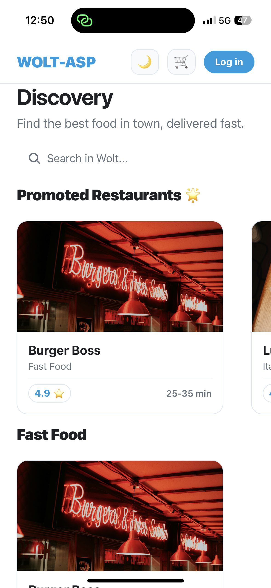
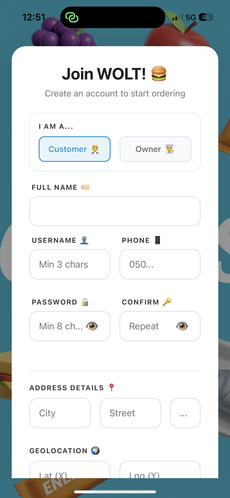
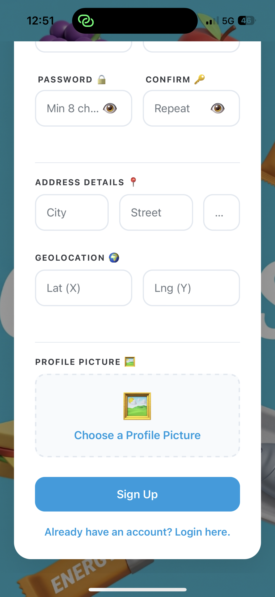
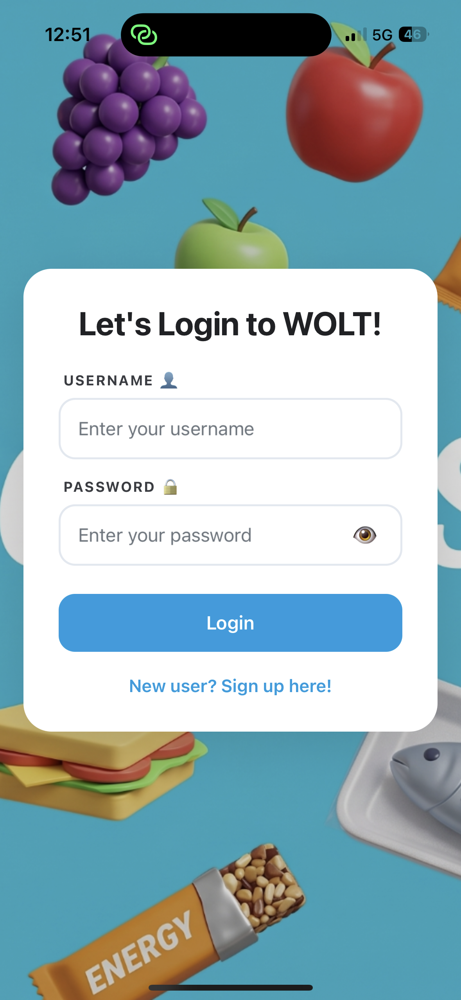
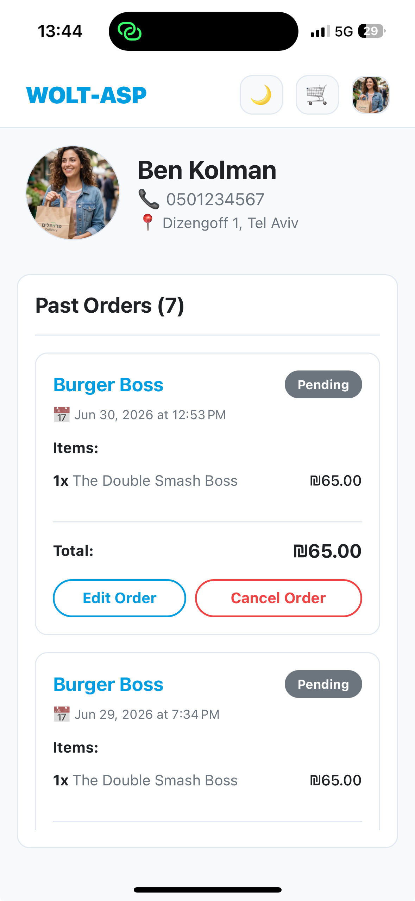

# Authentication & Registration

The WOLT-ASP system provides a full and secure authentication mechanism based on JSON Web Tokens (JWT). The application supports two types of users: **Customers** and **Owners** (Restaurant Managers).

---

## 🧐 Guest Access (Unregistered Mode)

Users are not strictly required to log in to browse the app. When opening the app, a user lands on the main Dashboard and can act as a Guest, browsing the restaurants and viewing menus. However, certain actions (like placing orders) are restricted to registered users.

---

## 📝 Registration Flow

To gain full access to the system, users must create an account.
On the Registration screen, the user enters their personal details, selects whether they are a customer or a restaurant owner, and can upload a profile picture directly from their device's gallery.

**Demo Steps for Evaluation:**
1. From the main Dashboard, click the "Login" button at the top to access the Login Screen.
2. At the bottom of the Login Screen, click on "New user? Sign up here!".
3. Fill in the required user details (Full Name, Username, Phone Number, Password).

4. Choose the user type (e.g., `Customer`).
5. Select a profile picture (the app will request gallery/camera permissions if necessary).
6. Fill in your address details and Geolocation (Lat/Lng).
7. Click the "Sign up" button at the bottom of the form.

---

## 🔐 Login Flow

After account creation (or for existing users), the login process takes place.

**Demo Steps for Evaluation:**
1. From the main Dashboard, click the "Log in" button at the top.
2. Enter the Username and Password of the account you just created.
3. Click on "Login".

4. If the credentials are correct, you will be successfully logged in and can access all features of the application.

---

## 👤 User Profile

Once logged in, a user can navigate to the Profile screen to view their personal details and orders.

