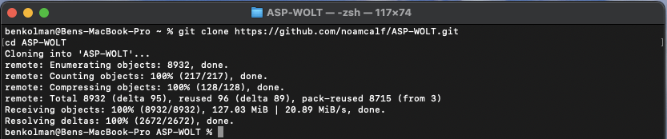
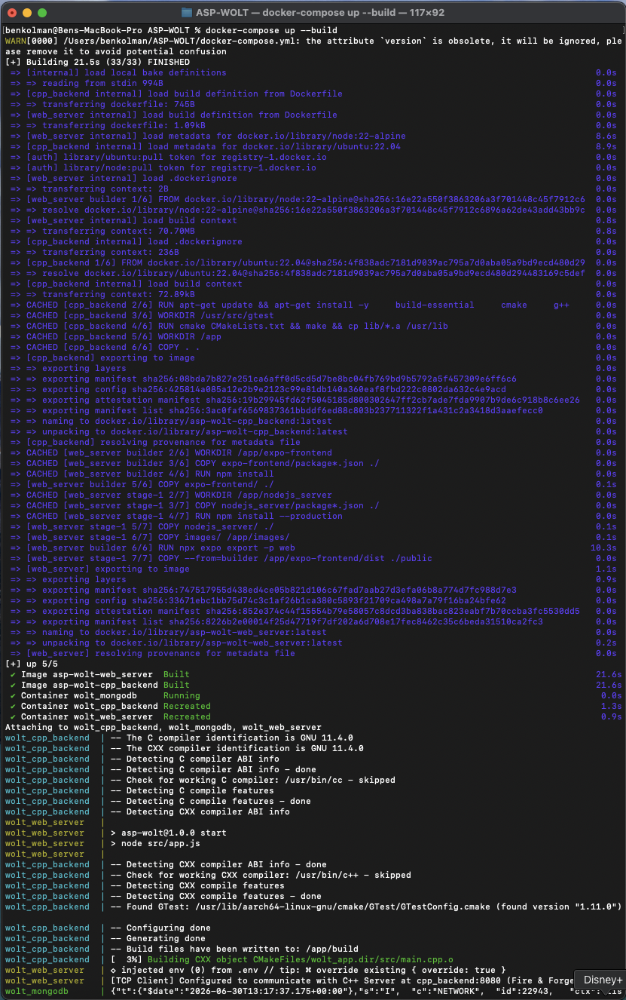
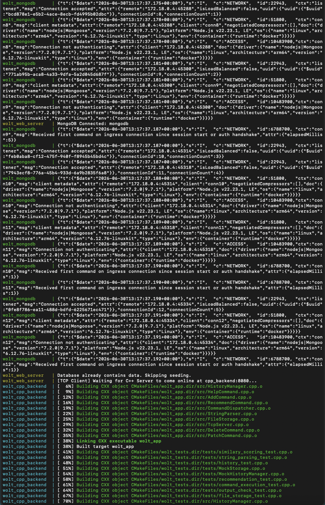
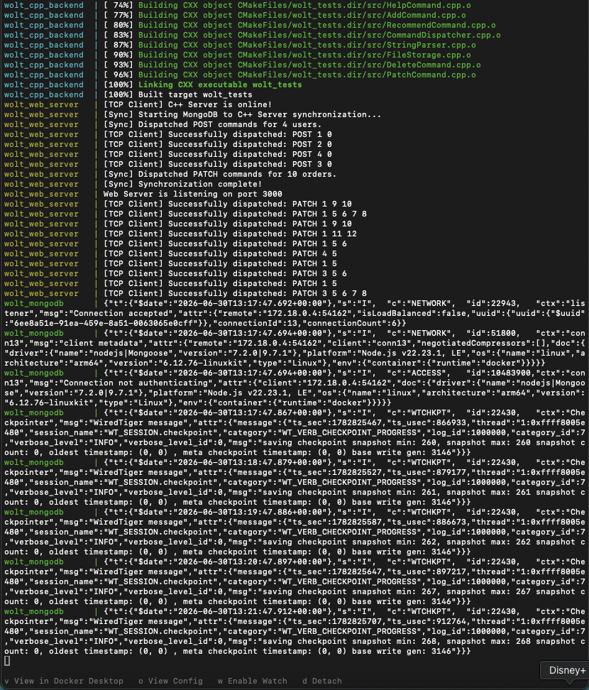
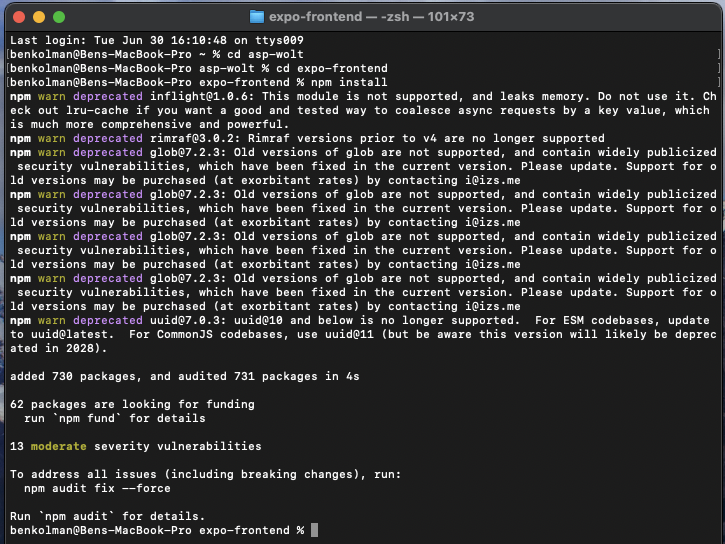
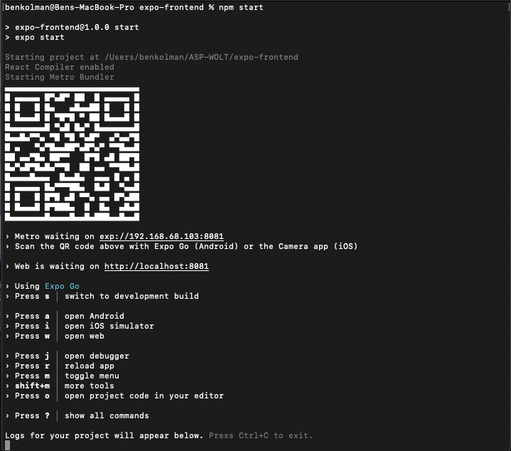

# Environment Setup

## 🛠️ Installation & Execution

We have optimized the execution flow using a **Multi-Stage Docker Build**. A single command sets up the Node.js API, compiles the C++ engine, and links them all together.

> [!NOTE]
> **Environment Variables & Security**
> For testing convenience and rapid evaluation, all necessary environment variables (including secrets like `JWT_SECRET` and the MongoDB connection URI) have been pre-configured as defaults directly inside the `docker-compose.yml` file. This means **you do not need to manually configure a `.env` file** to evaluate the project. 
> 
> However, we fully recognize that hardcoding secrets is a security risk in a real-world production environment. In a true production deployment, these variables would be extracted and securely injected via an isolated `.env` file (which would be added to `.gitignore`). To demonstrate this architecture, we have included a `.env.example` file in the repository showing how these secrets should properly be structured.

### 1. Clone the repository
First, download the project from GitHub and enter the main directory:
```bash
git clone https://github.com/noamcalf/ASP-WOLT.git
cd ASP-WOLT
```


### 2. Build and start the infrastructure
Start all servers (Node, MongoDB, C++) together using Docker Compose:
```bash
docker-compose up --build
```
*(Docker will handle downloading the images, compiling the C++ code, and launching the services).*





Wait until you see that the servers have started (MongoDB is ready, Node server is listening on port 3000, and the C++ server is listening on port 8080).

---

## 📱 Running the Application (Frontend)

Once the backend servers are running, you must launch the client application. You can do this in two different ways depending on how you wish to evaluate it:

### Option 1: Quick Web Run (No Configuration Required) 💻
In this mode, the application automatically detects it is running on your computer and directs API calls to `localhost:3000`.

1. Open a **new terminal window**.
2. Navigate to the client directory: 
```bash
cd expo-frontend
```


3. Install dependencies and run the application in your browser:
```bash
npm install
npm run web
```

### Option 2: Physical Device (Via Expo Go App) 📱
A physical phone does not recognize your computer's `localhost`. Therefore, if you wish to run the app on your personal phone, you must provide your computer's IP address.

1. Open the `expo-frontend` directory.
2. Create a new file named `.env`.
3. Add the following line to the file (Replace the IP with your computer's local IP address, e.g., `192.168.1.15`):
   ```env
   EXPO_PUBLIC_API_URL=http://<YOUR_LOCAL_IP>:3000
   ```
4. Run `npm start` and scan the QR code using the Expo Go app.


