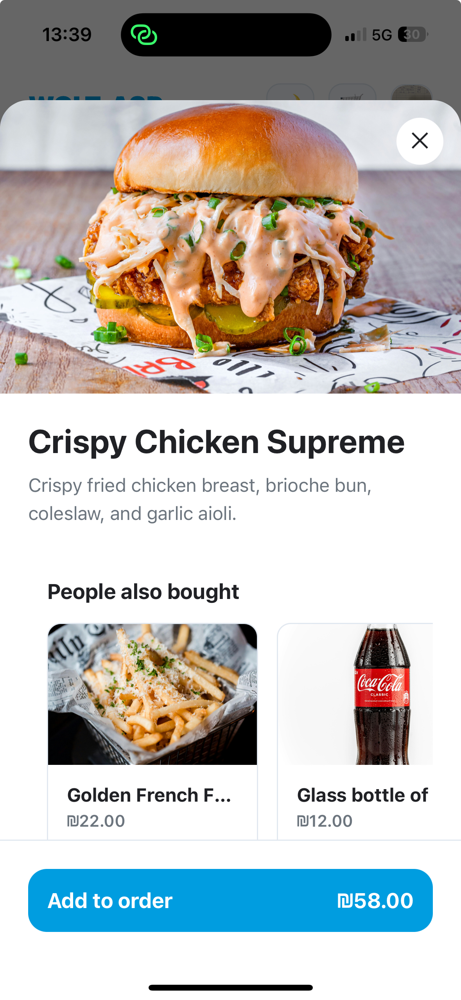
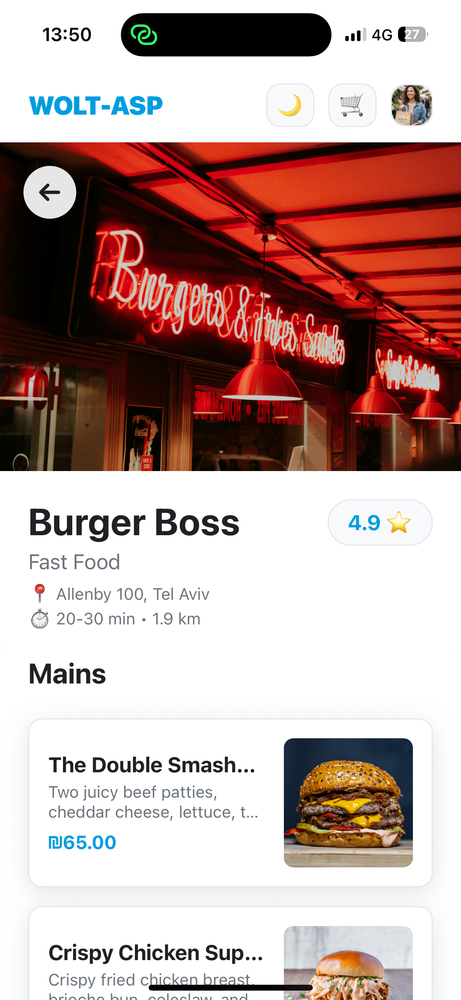
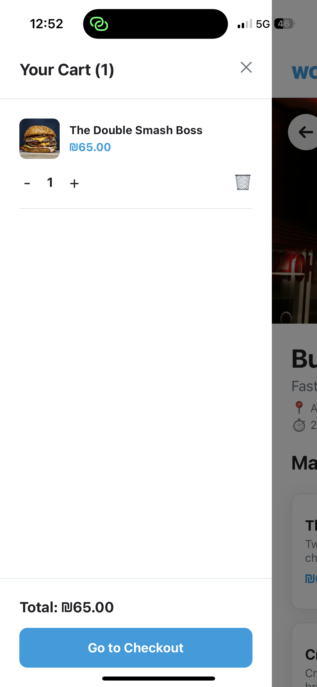
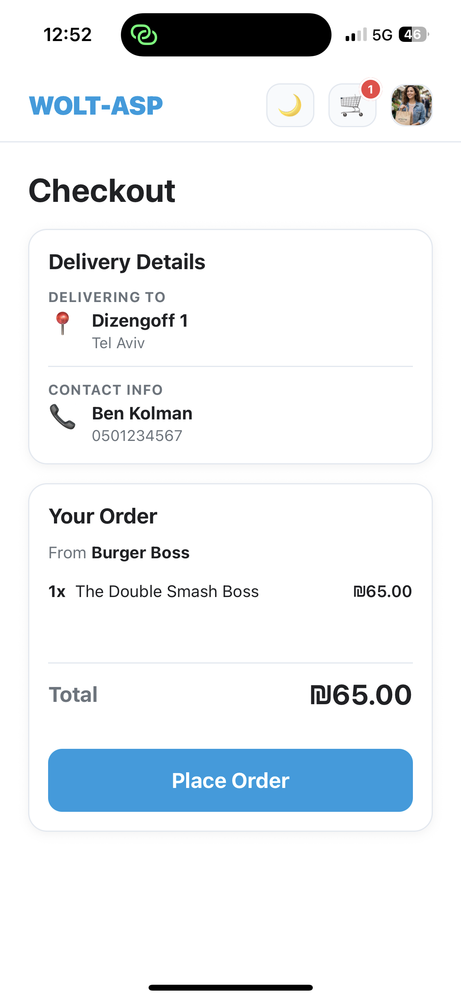
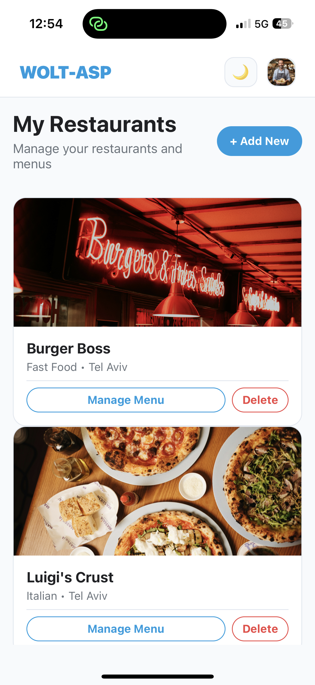
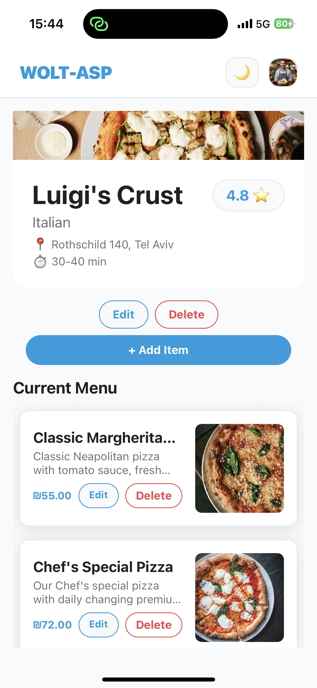
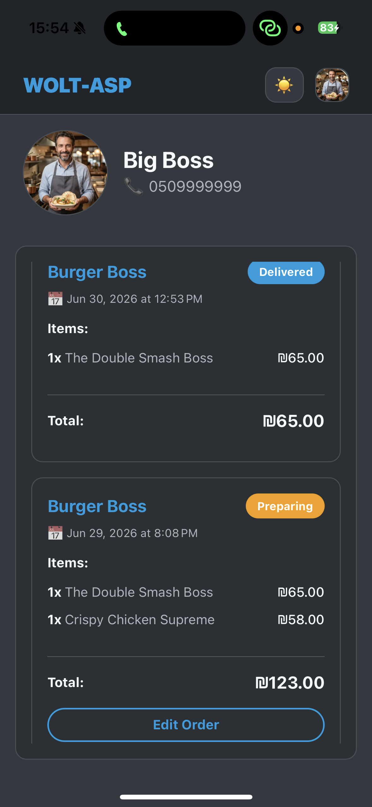
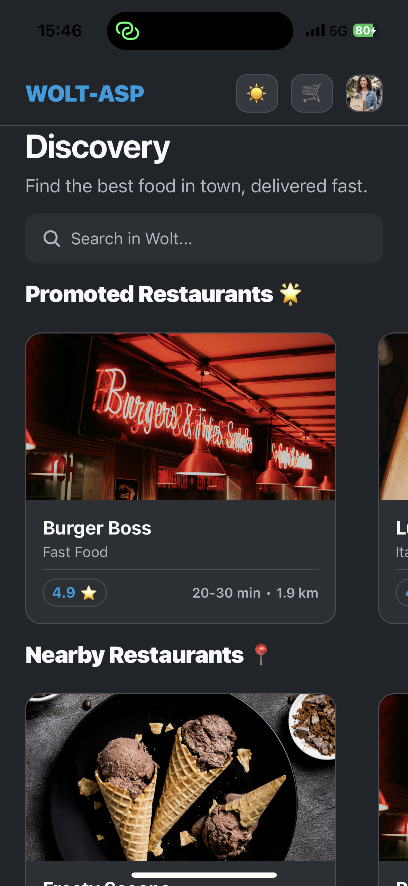

# Management Operations (CRUD) & Features

The system provides comprehensive management capabilities (CRUD) for restaurant owners on one hand, and an engaging food discovery and ordering experience for customers on the other. 
The application supports these operations across different clients (Mobile devices via Expo Go or Web Browsers).

---

## 🍔 Customer Flow: Discovery & Ordering

When logging into the system with a `customer` account, users can explore restaurants and make purchases. The discovery process involves our C++ recommendation engine which generates personalized feeds.

### 1. Smart Recommendations (C++ Engine)
On the `Dashboard` screen, the customer searches for a restaurant or selects one from the Recommendations Carousel. 

*The recommendations are calculated in real-time by our C++ TCP server based on past user behavior and collaborative filtering algorithms.*

### 2. Browsing Menus
The customer enters the restaurant page and can browse the catalog. The menu displays item descriptions, prices, and images. 

### 3. Managing Cart
Users add dishes to their Cart by tapping on a menu item and selecting the quantity in the popup modal. The Cart screen aggregates the items, calculates the subtotal, and provides a clear summary before checkout.

### 4. Checkout Process
On the `Checkout` screen, the customer reviews the final order, views their geographical location relative to the restaurant (distance is calculated dynamically), and clicks `Place Order`.

### C++ Engine Intervention (Post-Checkout):
Following a successful order placement, the Node.js server updates the MongoDB database, and then dispatches a background signal (TCP Socket) to the C++ microservice. The C++ server recalculates the "Recommendation" weights for the restaurants (e.g., boosting the score of the restaurant that was just ordered from). The next time the user returns to the Dashboard, this restaurant will be bumped up in the Recommendation lists.

---

## 🏬 Owner Flow: Restaurant Management

When logging into the system with an `owner` account, the user lands on the `OwnerDashboard`.
This screen aggregates all the restaurants owned by this specific user.

### 1. Owner Dashboard & Restaurant Creation
In the Owner Dashboard, the user can see their current restaurants or click the `Create Restaurant` button to open a creation form (uploading an image, setting descriptions and locations).

### 2. Menu Management (CRUD)
Inside the management screen of a specific restaurant, the owner can manage their entire menu catalog. 
Clicking `Edit` next to a dish opens a dynamic form to update the price, description, or image in real-time. Deleting a dish triggers a native confirmation warning to prevent accidental data loss.

---

## 🤝 Real-Time Order Management

The application features a shared, real-time Order History system accessed via the Profile screen. This system dynamically adapts based on the user's role and allows seamless cooperation between customers and restaurant owners.

### Shared Order Tracking
* **For Customers:** It displays a list of their past and active orders ("Past Orders").
* **For Owners:** It displays all incoming orders directed to their restaurants ("Incoming Orders").

### Collaborative Editing
Both the customer and the restaurant owner can manage and edit the exact same order, and changes are reflected in real-time. 
* A **Customer** can modify or cancel their order as long as its status is still "PENDING".
* An **Owner** can update the order status (e.g., from PENDING to PREPARING, and finally DELIVERED) to keep the customer informed.

This shared infrastructure ensures that both sides of the transaction are always synchronized.

---

## 🎨 UI Features

### Dark Mode Integration
The React Native frontend utilizes Expo's appearance API to fully support Dark Mode across both Mobile and Web platforms. When the user's system preferences are set to dark mode, the dashboard, cards, and text colors dynamically adapt to provide a sleek, eye-friendly experience.

